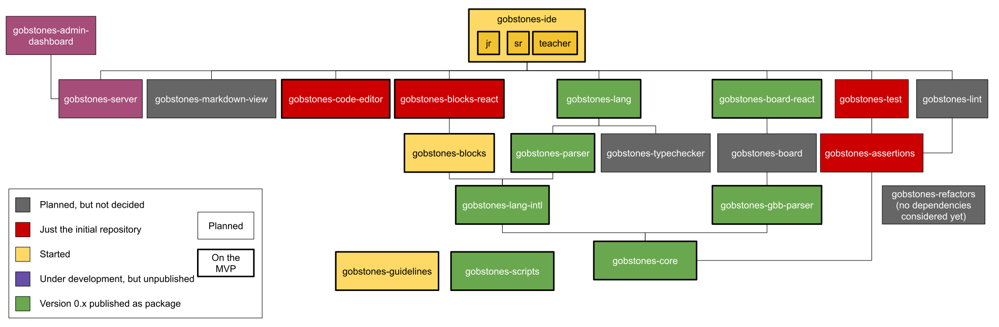

# **Architecture of **GobstonesWeb2**** 
The architecture of **GobstonesWeb2** combines several modules providing different functionalities
For each module, there will be a repository in the organization.
The guidelines ask for all repositories to share a basic configuration structure, and in order to ensure it, there is a special module, in repository [gobstones-scripts](https://github.com/gobstones/gobstones-scripts),that all repositories of **GobstonesWeb2** must depend on providing the means to automate such sharing. 
In this way, when the team decide to change something on the common configuration, all repositories can be easily updated.

The architecture of **GobstonesWeb2** is established by the dependencies between the modules provided by the different repositories belonging to the project, as presented in the following diagram:

List of repositories of <b>GobstonesWeb2</b>

The complete list of repositories to be used on **GobstonesWeb2** (either planned or under development).
* [`gobstones-admin-dashboard`](https://github.com/gobstones/gobstones/gobstones-admin-dashboard), a dashboard for the Gobstones server, 
* [`gobstones-assertions`](https://github.com/gobstones/gobstones/gobstones-assertions), a static and semantic code analyzer for Gobstones language, 
* [`gobstones-blocks`](https://github.com/gobstones/gobstones-blocks), a framework agnostic Gobstones Blockly component, 
* [`gobstones-blocks-react`](https://github.com/gobstones/gobstones/gobstones-blocks-react), the REACT layer over gobstones-blocks,
* [`gobstones-board`](https://github.com/gobstones/gobstones/gobstones-board), a representation for Gobstones boards,
* [`gobstones-board-react`](https://github.com/gobstones/gobstones/gobstones-board-react), the REACT layer over the gobstones-board,
* [`gobstones-code-editor`](https://github.com/gobstones/gobstones/gobstones-code-editor), a code editor to use with Gobstones,
* [`gobstones-core`](https://github.com/gobstones/gobstones-core), a set of utility tools used through all GobstonesWeb2 repositories,
* [`gobstones-ide`](https://github.com/gobstones/gobstones-ide), the IDE component, with the actual environment, 
* [`gobstones-gbb-parser`](https://github.com/gobstones/gobstones-gbb-parser), a parser/printer for GBB (Gobstones Board) file format,
* [`gobstones-guidelines`](https://github.com/gobstones/gobstones/gobstones-guidelines), fundamental documentation to contribute to GobstonesWeb2,
* [`gobstones-lang`](https://github.com/gobstones/gobstones/gobstones-lang), a compiler for Gobstones language,
* [`gobstones-lang-intl`](https://github.com/gobstones/gobstones-lang-intl), translation for Gobstones language built-ins and keywords, 
* [`gobstones-lint`](https://github.com/gobstones/gobstones/gobstones-lint), a linter for Gobstones language,
* [`gobstones-markdown-view`](https://github.com/gobstones/gobstones/gobstones-markdown-view), a markdown viewer for Gobstones,
* [`gobstones-parser`](https://github.com/gobstones/gobstones-parser), a parser for Gobstones language v3.12,
* [`gobstones-refactors`](https://github.com/gobstones/gobstones/gobstones-refactors), a refactoring tool for Gobstones language
* [`gobstones-scripts`](https://github.com/gobstones/gobstones-scripts), common configuration for all GobstonesWeb2 repositories
* [`gobstones-server`](https://github.com/gobstones/gobstones/gobstones-server), the Gobstones server,
* [`gobstones-test`](https://github.com/gobstones/gobstones/gobstones-test), a unit testing framework for Gobstones language,
* [`gobstones-typechecker`](https://github.com/gobstones/gobstones/gobstones-typechecker), a typechecker for Gobstones language.

